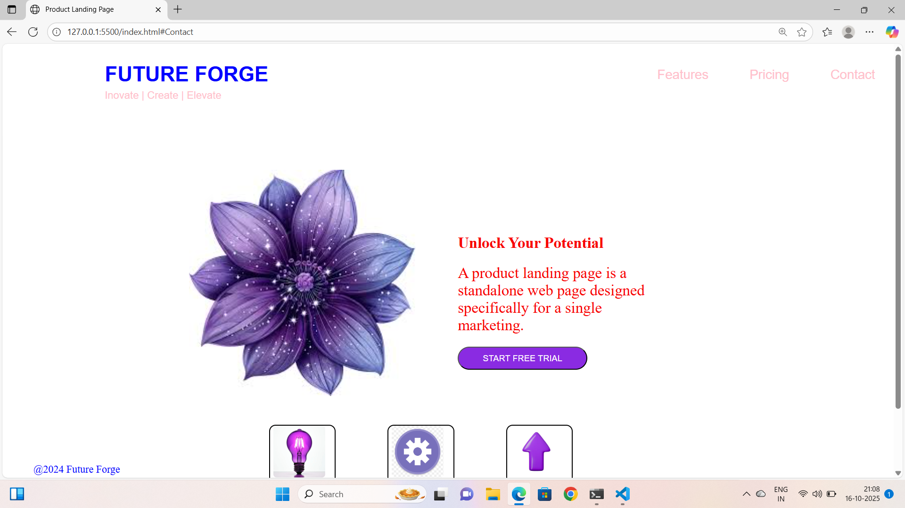

🌟 Product Landing Page

A modern, responsive Product Landing Page built using HTML5 and CSS3. This project showcases a sleek layout, smooth transitions, and user-friendly design principles that highlight a product effectively — perfect for portfolios, brand showcases, or business promotions.

🚀 Features

🎨 Responsive Design: Works seamlessly on desktops, tablets, and mobile devices.

⚡ Smooth Transitions: CSS animations and hover effects for better user experience.

🧭 Clean Navigation Bar: Easy scrolling and smooth navigation between sections.

📦 Product Showcase: Highlight product features, benefits, and visuals attractively.

📨 Contact Section: Includes a simple and aesthetic contact form design.
🛠️ Technologies Used

HTML5 – For structure and content

CSS3 – For styling and animations

(Optional) Google Fonts & Icons – For modern typography and icons
📁 Folder Structure
Product-Landing-Page/
│
├── index.html          # Main HTML file
├── style.css           # Main stylesheet
├── images/             # Product and banner images
└── README.md           # Project documentation
🧩 Sections Included

Header / Navigation

Hero Section (Product Introduction)

About / Features Section

Product Gallery or Highlights

Testimonials (Optional)

Contact / Subscription Form

Footer

💡 Learning Outcomes

By building this project, you will learn:

How to structure a responsive web page layout using HTML and CSS

Use of Flexbox and Grid for alignment

Implementing smooth CSS transitions and hover effects

Building visually appealing product pages for marketing or portfolio purposes

## 📸 Screenshots

| Desktop View | Mobile View |
|---------------|--------------|
|  |  |

Here’s how the landing page looks:

🖼️ Replace the above image paths (Product landing webpage.png) with your actual screenshot file paths.
https://github.com/ankithakanneboina/ProductLandPage/blob/main/Product%20landing%20webpage.png

🧑‍💻 Author

Ankitha Kanneboina
📧 ankithakanneboina350@gmail.com

🔗 GitHub
 | LinkedIn

📝 Final Note

🌈 Started as a timepass project — but turned out to be one of my best creations! ✨

📜 License

This project is open-source and available under the MIT License
.
